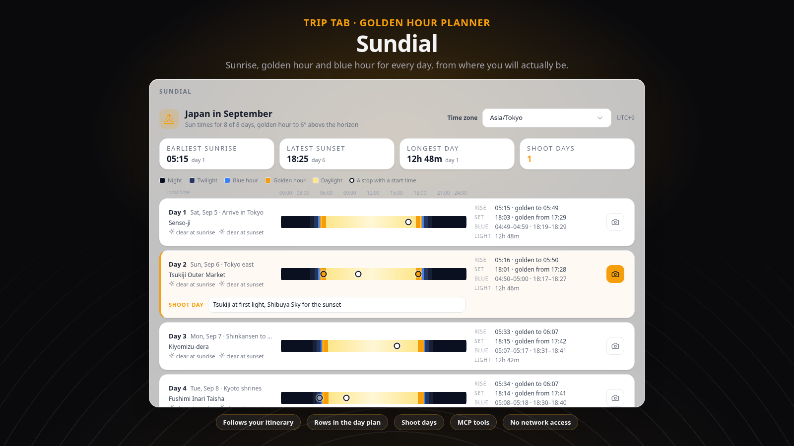

# Sundial

> Sunrise, sunset, golden hour and blue hour for every day of your trip, computed from where you will actually be.



## What it does

Sundial adds a **Sun** tab to every trip planner. For each day it works out where you
will be, then computes the full run of solar events at that spot: astronomical, nautical
and civil twilight, the blue hour, sunrise, the morning golden hour, solar noon, the
evening golden hour, sunset, and the day's length. The maths is NOAA's solar-position
algorithm, run inside the plugin, so it works for any date, anywhere, without asking a
single external service. Polar day and polar night are handled properly, and the
tab tells you when a day has no located stop to compute from.

"Where you will be" follows the itinerary rather than the trip's cover city: the first
located stop of the day, else the accommodation that covers the day, else the previous
day's location, else the first located place in the trip's place pool. A trip that moves
from Tokyo to Kyoto to Miyajima gets Tokyo's sunrise on Tokyo days and Miyajima's on
Miyajima days. Each stop with a start time is plotted on the day's daylight bar, so you
can see at a glance whether a viewpoint is booked for the golden hour or for the dark.

You can mark any day as a **shoot day**, with a short note. Marks are shared with the whole
trip. Sundial then paints that day gold in the planner's day list, shows a "Shoot days"
badge on the trip's dashboard card, and lists the marked days in the exported PDF.

Because it feeds TREK's own surfaces rather than only its tab, most of Sundial is visible
without opening it: sunrise and golden-hour rows at the top and foot of every day in the
plan, sunrise and sunset at the foot of each place's detail panel, a planner warning when a
stop is scheduled before sunrise or after sunset, and a "Sun and light" table appended to
the trip PDF. Three MCP tools let an assistant connected to TREK ask for sun times and
manage shoot days on your behalf.

Times are shown in the trip's time zone. Until you pin one in the tab, Sundial estimates a
zone from each day's location: a built-in table of regions maps the places people travel
to onto real IANA zones (so France is CET although it sits in the UTC band, China keeps one
zone, India is on the half hour, and daylight saving comes out right), and only a spot the
table does not know falls back to the longitude band. The tab says which it used. Pin the
real zone from the list once to be sure; it is remembered for the trip. A pinned zone
is one zone for the whole trip: when a day's location sits more than ninety minutes away
from it (Zurich pinned, a day in Tokyo), that day is flagged in the tab and in the planner
warnings rather than quietly showing Zurich's clock. Near the poles, any phase the sun never
reaches that day is simply left blank: a midwinter day with civil twilight but no sunrise,
or a midsummer day where the sun stays too low to ever leave the golden hour. For days
inside the next two weeks the tab also shows the forecast sky at sunrise and sunset, taken
from TREK's own weather cache.

## Screenshots


## Permissions

| Permission | Why this plugin needs it |
|---|---|
| `db:own` | Stores the trip's pinned time zone, the shared shoot-day marks with their notes, and a small index of place coordinates so the place panel can answer without scanning every trip. Nothing else is stored. |
| `db:read:trips` | Reads the trip's days, stop assignments, accommodations and place pool to work out where you are each day and at what time each stop starts. Every read is membership-checked by TREK against the person viewing. |
| `db:meta` | Mirrors the pinned zone onto the trip and each shoot-day mark onto its day as plugin metadata, so other plugins and future TREK surfaces can see them. Best-effort: Sundial's own database stays the source of truth. |
| `ws:broadcast:trip` | After a member marks a shoot day or pins the zone, pings the trip so an open Sun tab on another member's screen refreshes. Only a refresh signal is sent, never the data. |
| `weather:read` | Asks TREK's host-cached forecast for the sky at sunrise and sunset on days within the forecast window, to show next to the golden hours. No key, no direct network access. |
| `events:subscribe` | Listens for a day or a trip being deleted, to drop the matching shoot-day marks and index rows. Runs without a user and touches only Sundial's own data. |
| `hook:day-schedule-provider` | Adds a sunrise-and-golden-hour row at the start and a golden-hour-and-sunset row at the end of each day in the planner. |
| `hook:day-tint-provider` | Paints shoot days gold in the planner's day list and mobile day strip. |
| `hook:place-detail-provider` | Shows sunrise, sunset, golden hour and blue hour at the foot of a place's detail panel, for the day the place is planned on. |
| `hook:trip-warning-provider` | Raises an informational planner warning when a stop starts before sunrise or after sunset, and a warning when a shoot day has no located stop to compute from. |
| `hook:pdf-section-provider` | Appends a "Sun and light" table, and a shoot-day list, to the exported trip PDF. |
| `hook:trip-card-provider` | Adds a "Shoot days" badge to the dashboard card of a trip that has marked days. |
| `hook:user-data` | Honours account erasure and export: erasure detaches the user from marks they made (the trip's shared plan is kept), export returns exactly those rows. |
| `mcp:tools` | Publishes three tools on TREK's MCP server, `sun_times`, `list_shoot_days` and `mark_shoot_day`, so an assistant can ask for sun times and manage shoot days as the requesting user. |

No outbound network access is declared: every sun time is computed locally, and weather
comes from TREK's own broker.

## Setup

Install and activate Sundial from Admin, then open any trip: the **Sun** tab appears next
to the planner's other tabs. There is nothing to configure for it to work.

Two per-user settings live under Settings, Plugins:

- **Golden hour ends at sun altitude**: how high the sun may climb before the light stops
  counting as golden (4, 6, 8 or 10 degrees; 6 is the classic definition). Golden hour
  always starts 4 degrees below the horizon, right after the blue hour.
- **Clock**: 24-hour or 12-hour times, applied everywhere Sundial writes a time.

In the tab itself, pick the trip's time zone from the list so times are exact local time
rather than a longitude estimate; the choice is shared with every member of the trip.

MCP tools are advertised as `plugin_sundial_sun_times`, `plugin_sundial_list_shoot_days`
and `plugin_sundial_mark_shoot_day` to assistants whose token carries the `plugins:use`
scope. `sun_times` answers in the same shape in both modes: every phase is a wall-clock
string or a `"start-end"` range, and `null` when the sun never reaches it; `zone` may be
passed in either mode.

## Changelog

- **1.2.0**: the automatic zone comes from a region table (about 130 boxes to real IANA
  zones) before the longitude band, so Lyon is CET rather than UTC and Honolulu is UTC-10
  rather than UTC-11; `zoneMethod` (`region` / `longitude` / `user` / `request`) says how a
  zone was chosen; the forecast sky's fallback hour uses the same estimate.

- **1.1.0**: polar and high-latitude answers never contain `null-null` ranges; `shootDay` is
  always `{ on, note }`; `zone` is honoured in trip mode; both `sun_times` modes share one
  field order; days whose location lies outside the trip's pinned zone are flagged.
- **1.0.0**: first release.

## Building

Plain JavaScript, no build step. `server/index.js` is the entry, `server/sun.js` the solar
engine, `server/model.js` the per-day model, and `client/index.html` the tab.

```bash
npm install
npm test                 # solar engine against almanac values + the plugin on the mock host
npm run dev              # http://localhost:4317 — open /preview for the themed tab
npm run preview-shot     # docs/preview-light.png + docs/preview-dark.png
npm run shot             # docs/screenshot.png, the store image
```

## License

MIT
